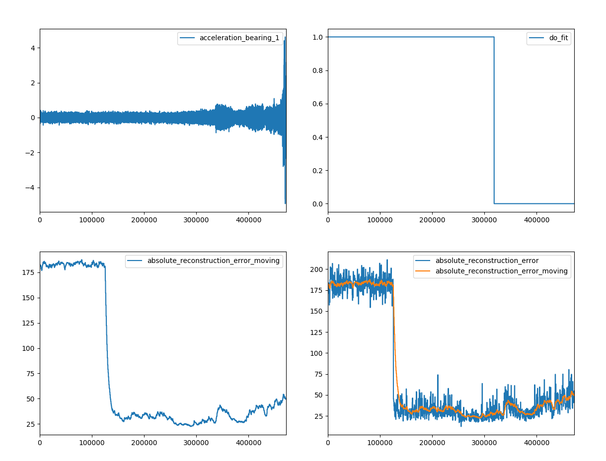

# Machine Learning 4 IIoT

This is the repository of `ml4iiot` a framework to implement Machine Learning methods for time series data.

## Example: Autoencoder on FFT of IMS Bearing Data Set

This example shows an autoencoder being trained on the Fast Fourier transform 
of the acceleration of bearing 1 of the [IMS Bearing Data Set](https://ti.arc.nasa.gov/tech/dash/groups/pcoe/prognostic-data-repository/).
The configuration of this experiment can be found in `config/ims_bearing_data_set_autoencoder.yaml`. 
The autoencoder learns (adjusts its weights) and predicts until the `2004-02-17` and after that does only predictions anymore (see `do_fit`).
The results show that the upcoming crash shows up in an increasing reconstruction error of the autoencoder.

- Run IMS Bearing Data Set Autoencoder example: `python ml4iiot/cli_runner.py -c config/ims_bearing_data_set_autoencoder.yaml`
- Plot acceleration of bearing 1: `python ml4iiot/plot_csv.py -p out/YYYY_MM_DD/ims_bearing_data_set/HH_MM_SS_csv_output.csv -itime acceleration_bearing_1`
- Plot reconstruction error: `python ml4iiot/plot_csv.py -p out/YYYY_MM_DD/ims_bearing_data_set/HH_MM_SS_csv_output.csv -itime absolute_reconstruction_error_moving`



## Architecture

We abstract the entire process into a pipeline consisting of different processing steps. 
Each pipeline must have an input, an algorithm and an output step. 
Before and after the algorithm step there can be any number of pre- or post-processing steps.

A pipeline can configured using YAML or JSON files and can be started with the CLI runner.


The main abstraction between individual pipeline steps are pandas DataFrames. 
Each step can add additional columns to the dataframe but should not alter existing columns.


## Development

### Setup virtualenv

```
pip install virtualenv;
python -m virtualenv env;
source env/bin/activate;
```

### Install dependencies

```
pip install -r requirements.txt;
pip install -e .;
```

### Testing

Run unit tests with: `python -m unittest discover tests/*`

### Leave virtualenv

- `deactivate`

## CLI runner

```
python ml4iiot/cli_runner.py -c config/your_config.yaml
```

## Performance

Resample the training data in advance and use integer timestamps instead of formatted date strings to speed up trainings. 
Use the following commands to profile your code:

```
python -m cProfile -o out/cli_runner.profile ml4iiot/cli_runner.py -c config/your_config.yaml
```

```
snakeviz out/cli_runner.profile 
```

## Docker

```YAML
version: '3'
services:
  ml4iiot:
    image: still/to/be/published
    volumes:
      - ./ml4iiot/config:/usr/src/ml4iiot/config
```

## Pipeline configuration

A pipeline always consists of an input adapter, an output adapter as well as an algorithm in between. 

```yaml
pipeline:
  input:
    class: ml4iiot.input.csv.CsvInput
    config:
      windowing_strategy:
        class: ml4iiot.input.windowing.CountBasedWindowingStrategy
        config:
          window_size: 100
          stride_size: 100
          batch_size: 20000
      delimiter: ','
      csv_file: /path/to/your/data.csv
      index_column: time
      columns:
        time:
          type: datetime
          datetime_format: timestamp
        sensor_value: float

  algorithm:
    class: ml4iiot.algorithm.stochastic.average.ExponentialWeightedMovingAverage
    config:
      column_mapping:
        sensor_value: sensor_value_average

  output:
      class: ml4iiot.output.compound.CompoundOutput
      config:
        output_adapters:
          - class: ml4iiot.output.std.StdOutput
            config:
              show_columns_progress:
                - column: index
                - column: sensor_value
                - column: sensor_value_average
          - class: ml4iiot.output.plot.PlotOutput
            config:
              show_plots: True
              figures:
                  plots:
                    - column: sensor_value
                      color: blue
                    - column: sensor_value_average
                      color: red
```

### Inputs
- `ml4iiot.input.csv.CsvInput`
- `ml4iiot.input.kafka.KafkaInput`

#### Windowing strategies

- `ml4iiot.input.windowing.TimeBasedWindowingStrategy`
- `ml4iiot.input.windowing.CountBasedWindowingStrategy` 

### Algorithms
- `ml4iiot.algorithm.stochastic.average.ExponentialWeightedMovingAverage`
- `ml4iiot.algorithm.stochastic.average.ExponentialWeightedMovingMinMaxAverage`
- `ml4iiot.algorithm.stochastic.mad.Mad`
- `ml4iiot.algorithm.stochastic.zscore.ModifiedZScore`
- `ml4iiot.algorithm.clustering.dbscan.DBSCAN`
- `ml4iiot.algorithm.autoencoder.fullyconnected.FullyConnectedAutoencoder`
- `ml4iiot.algorithm.autoencoder.cnn.CNNAutoencoder`
- `ml4iiot.algorithm.autoencoder.cnn.BottleneckCNNAutoencoder`
- `ml4iiot.algorithm.autoencoder.lstm.ReconstructionLSTMAutoencoder`
- `ml4iiot.algorithm.autoencoder.lstm.PredictionLSTMAutoencoder`
- `ml4iiot.algorithm.autoencoder.variational.VariationalAutoencoder`

### Processing
- `ml4iiot.processing.normalization.MinMaxScaler`
- `ml4iiot.processing.smoothing.MovingExponentialSmoothing`
- `ml4iiot.processing.transform.Average`
- `ml4iiot.processing.transform.StandardDeviation`
- `ml4iiot.processing.transform.Minimum`
- `ml4iiot.processing.transform.Maximum`
- `ml4iiot.processing.transform.FastFourierTransform`
- `ml4iiot.processing.control.SkipDataFrame`

### Outputs
- `ml4iiot.output.compound.CompoundOutput`
- `ml4iiot.output.std.StdOutput`
- `ml4iiot.output.plot.PlotOutput`
- `ml4iiot.output.csv.CsvOutput`
- `ml4iiot.output.kafka.KafkaOutput`
- `ml4iiot.output.config.ConfigOutput`
